# 🛒 Retail Store Application

Full-stack Retail Store web app with **React (Vite)** frontend and **Spring Boot** backend.  
Supports **JWT auth**, **USER/ADMIN roles**, **Cart → Checkout**, **Orders**, **Admin CRUD**, and **Razorpay payments**.

---

## Folder Structure

client/
├── .idea/                    # IDE settings (optional)

├── node_modules/             # dependencies (auto-generated)

├── public/                   # static files (favicon, etc.)

├── screenshots/              # README screenshots for each page

├── src/

│   ├── assets/               # images, icons, static assets
│   ├── components/           # reusable UI components
│   ├── context/              # Context API (cart/auth/items state)
│   ├── pages/                # route-level pages/screens
│   ├── service/              # API calls (axios services)
│   ├── util/                 # helpers, constants, formatters
│   ├── App.css
│   ├── App.jsx
│   ├── index.css
│   └── main.jsx
├── .gitignore
├── eslint.config.js
├── index.html
├── package.json
├── package-lock.json
├── README.md
├── STRUCTURE.txt             # generated folder tree (optional)
└── vite.config.js

## 📸 Screenshots

### Auth
#### Login

---

### Admin Pages
#### Admin Dashboard
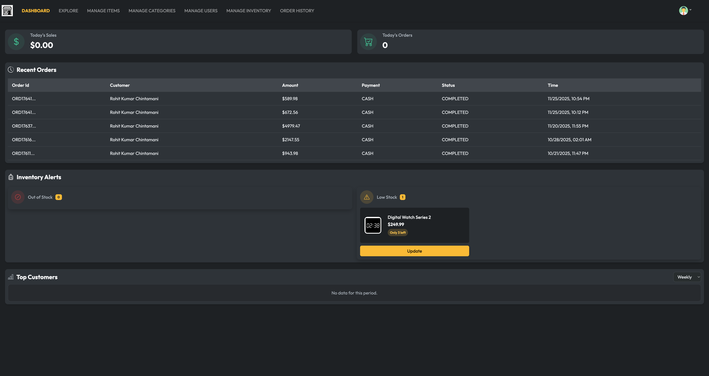

#### Explore
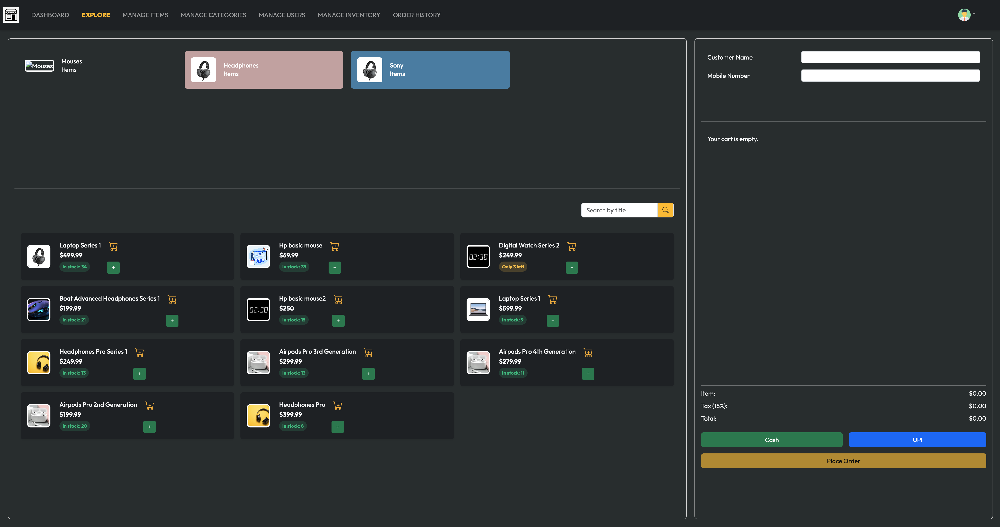

#### Manage Items (CRUD)

#### Manage Categories
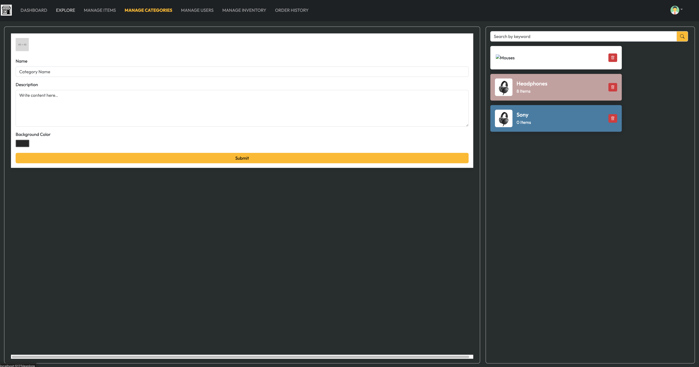

#### Manage Users
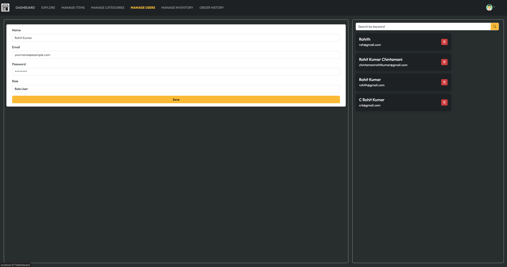

#### Manage Inventory
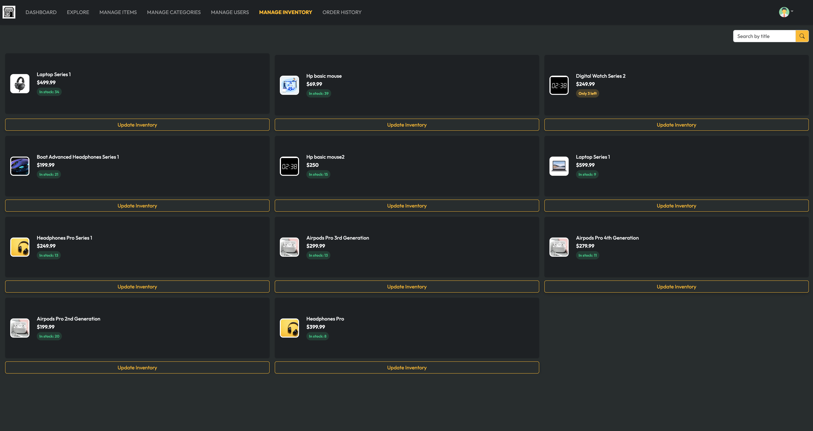

#### Order History
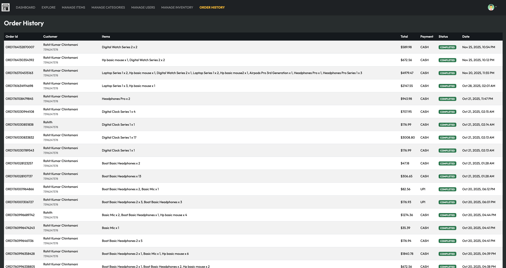

#### Update Inventory
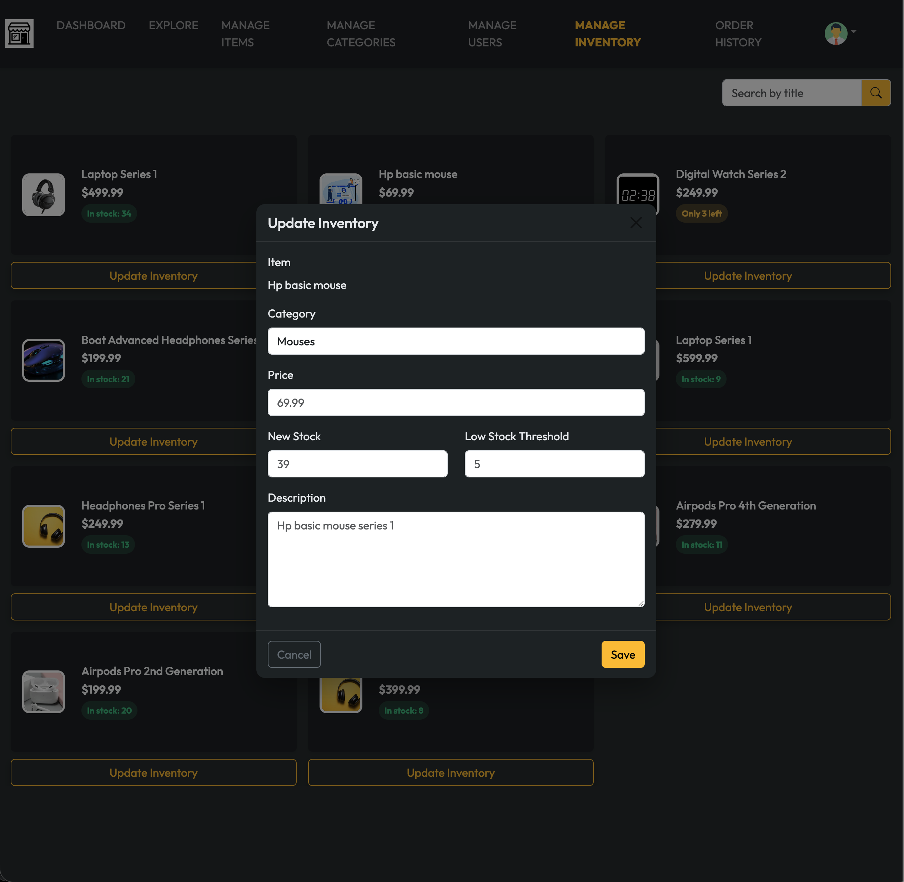

---

### User Pages
#### User Dashboard

#### Explore
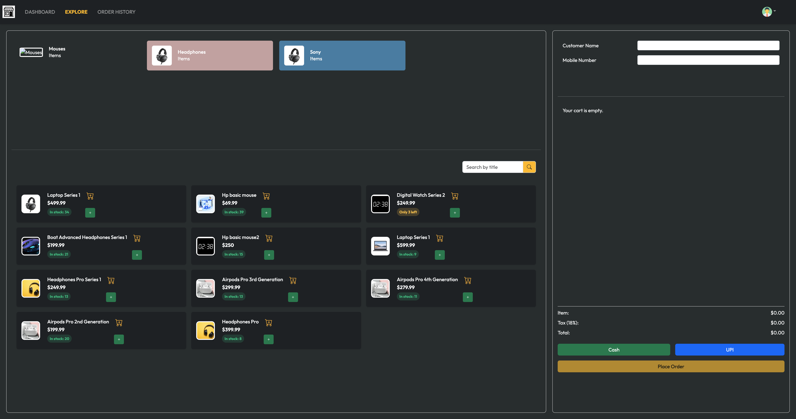

#### Order History
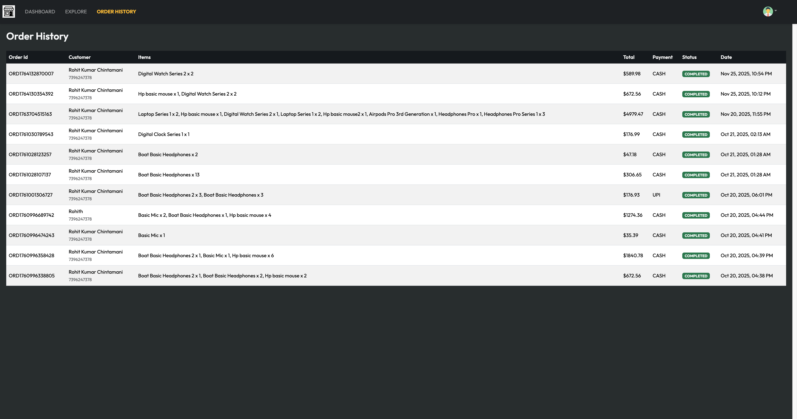

---

### Cart & Payment
#### Cart Items
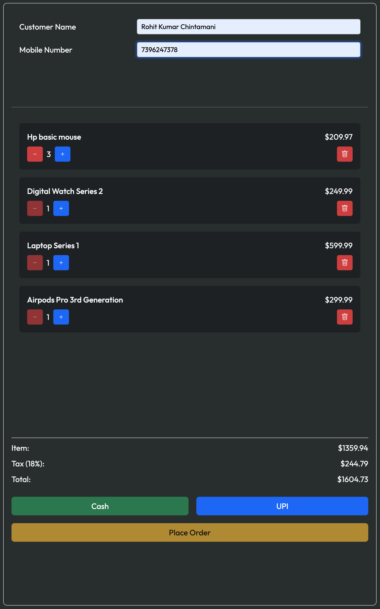

#### Cash Payment
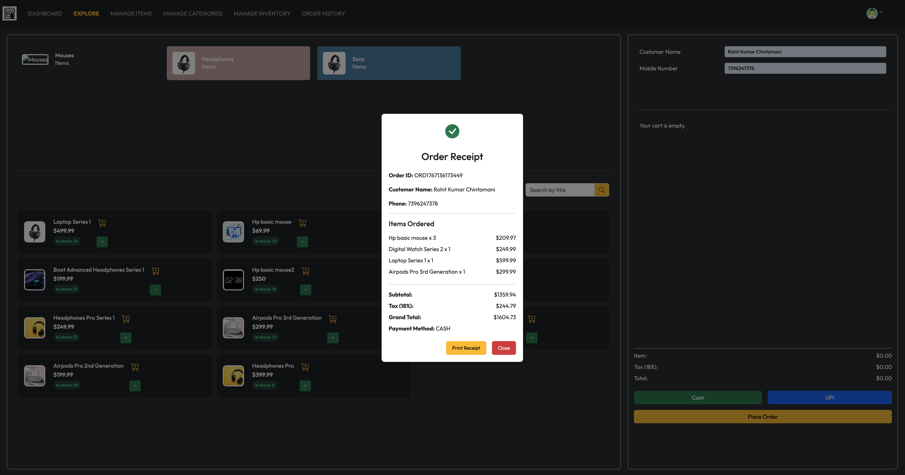

#### RazorPay Payment
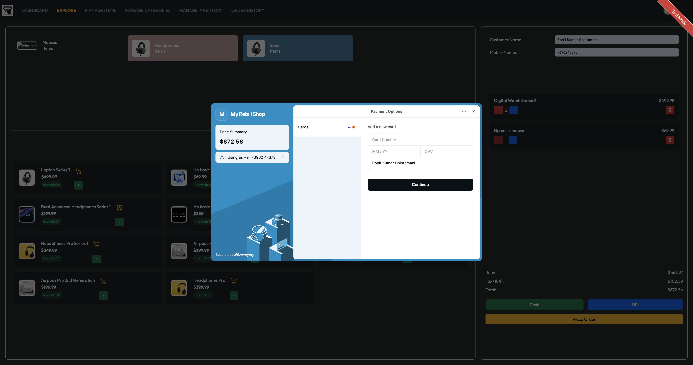

---

## ✨ Key Features

### 👤 Customer (USER)
- JWT login/signup
- Browse items + categories
- Add to cart, update quantity, remove items
- Checkout with **Cash** or **Online Payment (Razorpay)**
- View order history + latest order

### 🧑‍💼 Clerk
- Create orders for walk-in customers (POS-style flow)
- Add/remove items in a cart and update quantities
- Choose payment method (Cash / Online)
- View recent orders (based on access rules)
- Can update inventory quantity only

### 👨‍💼 Manager
- Monitor store performance (sales + order count)
- View recent orders with pagination
- Track payment status (**PENDING / COMPLETED**)
- Can update inventory quantity and price adjustments too

### 🛠️ Admin
- Full role-based access control (USER / CLERK / MANAGER / ADMIN)
- Admin dashboard (today sales, today orders, recent orders with pagination)
- Category CRUD
- Item CRUD
- Manage orders (create/delete/latest)
- Configure payment workflow (Razorpay create-order + verify)
- Enforce security via Spring Security + JWT

### 💳 Payments
- Razorpay **order creation**
- Razorpay **signature verification**
- Payment status tracking (**PENDING / COMPLETED**)
- Cash orders marked as **COMPLETED** immediately

## 🧱 Tech Stack

**Frontend**
- React (Vite)
- Axios
- Context API (cart/items state)
- React Router
- Bootstrap / custom CSS (as used in your UI)

**Backend**
- Spring Boot (REST APIs)
- Spring Security + JWT
- JPA/Hibernate
- MySQL
- Razorpay integration

---
